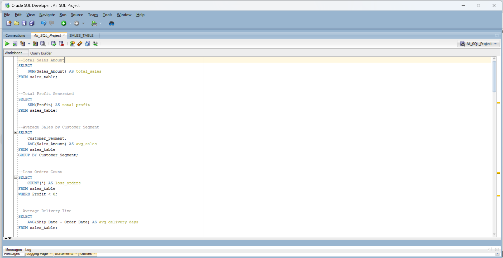
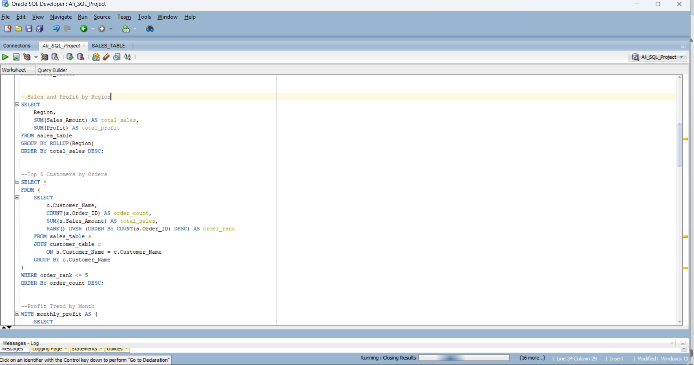

# SQL Data Analysis Project

This repository contains **15 Oracle SQL queries** for analyzing sales data. 
The queries cover:

- Basic aggregation (SUM, AVG, COUNT)
- Grouping (GROUP BY, ROLLUP, GROUPING SETS)
- Conditional aggregation using CASE
- Window functions (RANK, LAG)
- Joins with customer and product tables
- Advanced analytics for sales, profit, delivery, and discount analysis

## Files

- `sales_analysis.sql` : All queries in one file, ready to run in Oracle SQL Developer.

## Usage

Open `sales_analysis.sql` in Oracle SQL Developer or any SQL editor and run the queries to explore sales and profit trends.

## Author

Allahverdi Aliyev 

## Example Results

